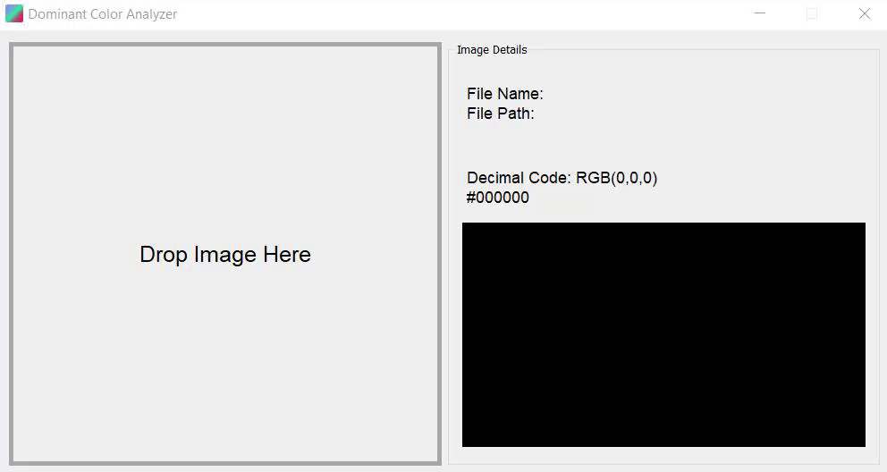

<h1 align="center">Color Analyzer</h1>

A python GUI program that will take a given image and identify colors on top of your mouse clicks.

## How to Use
Open the ColorAnalyzer executable file. Running through .py file is possible but not needed.

## Workflow Plan During Development
1. Create a GUI with a background
2. Implement a drag and drop feature for images
3. Display the image
4. Convert image into identifiable data
5. Gather all the colors and set a threshold for how many dominant colors to display
6. Show color and percentage found in the image

## Possible Future Improvements to Program
1. Restrict clickable area for color identification
2. Add zoom in feature for image
3. Proper scaling of application window

## Donation
Support me by clicking on the link below!

## Disclaimer
Do not copy and redistribute without my permission.
